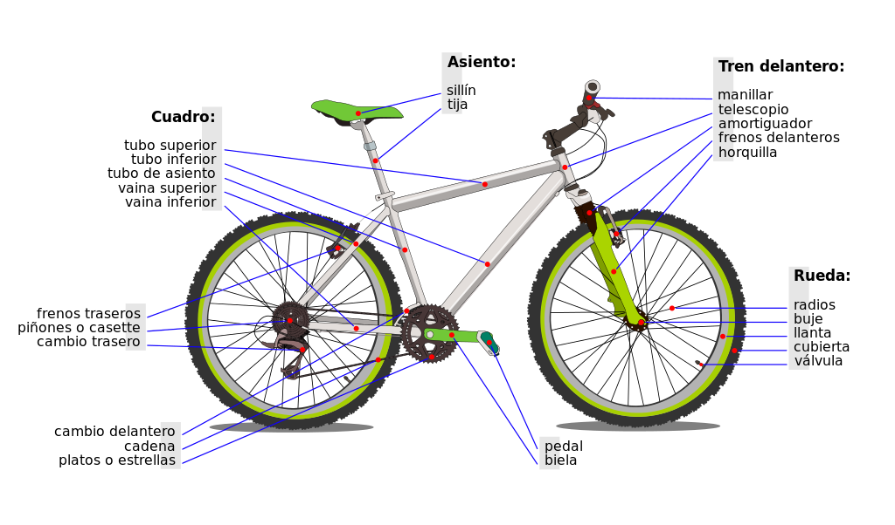
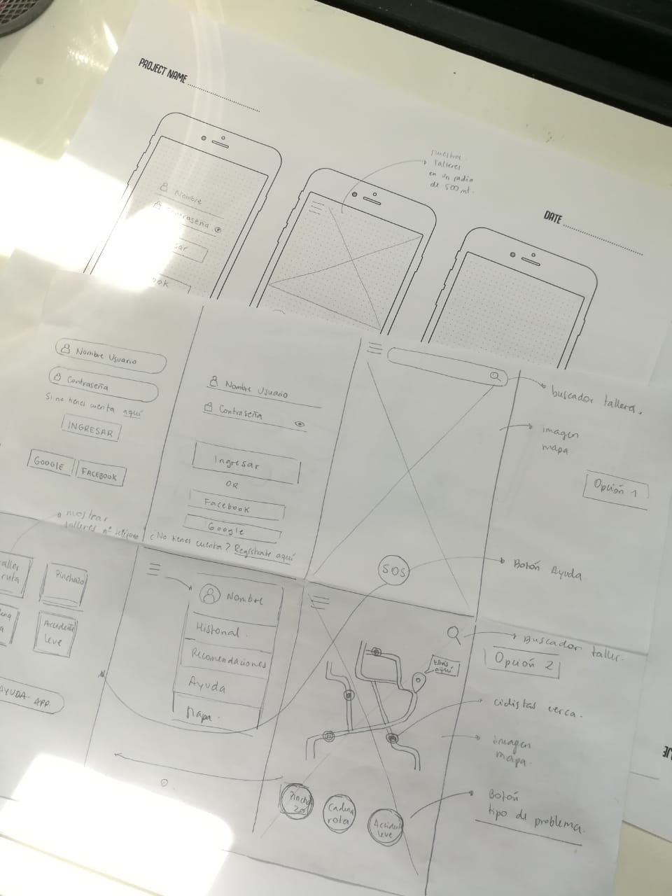
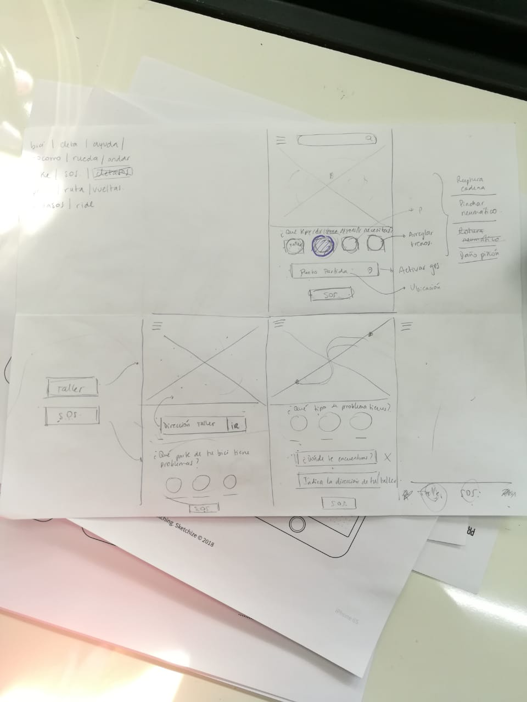
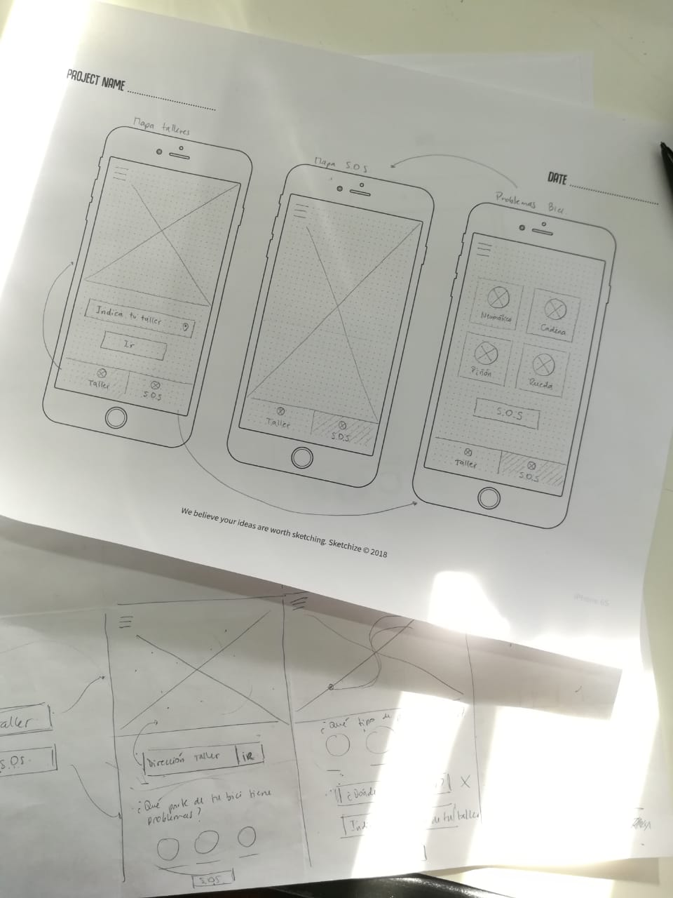
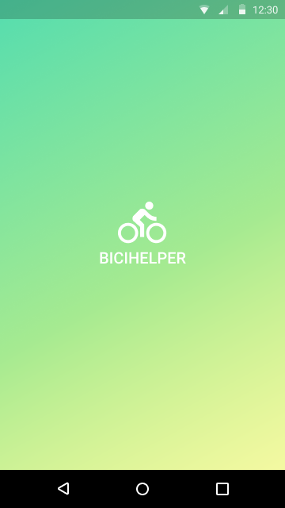
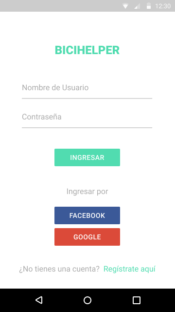

# BICIHELPER
## Desafío

El desafío es planteado por la empresa Here y está enfocado en cómo usamos el espacio como peatones, ciclistas, usuarios del transporte público y automovilistas en Chile, mediante el uso de mapas.

Debido al corto tiempo de trabajo (3 días), nuestro equipo aportará y enfocará este desafío en el uso del espacio como ciclistas.

## Equipo y Plazos

Este proyecto fue designado a un equipo de tres Desarrolladoras Front End y una Diseñadora UX:

### `Desarrolladoras Front End`

- Verónica Manchola
- Leslie Sabattin
- Paulina Vera

### `Diseñadora UX`

- Natalie Veloso

Tiempo de Ejecución: 3 días

Fecha de Entrega: 24 de Mayo de 2016

Puedes ver nuestra planificación en Trello [aquí](https://trello.com/b/Y6h2mvkO/hackathon-here)

## Problemática

En Santiago, la bicicleta se ha transformado en uno de los medios de transporte que cada vez va sumando más usuarios, debido a sus beneficios económicos, para la salud y el medioambiente, pero el hecho de no prepararse antes de salir y no guardar las herramientas necesarias en caso de cualquier incidente que ocurra en el trayecto, puede ocasionar que el ciclista quede parado en medio del viaje, tener que caminar varios kilómetros, largas esperas de que alguien con buena voluntad y espacio en un vehículo lo/la pueda llevar, buscar algún lugar donde encontrar herramientas y donde pueda entrar con bicicleta o simplemente esperar que aparezca alguna persona en la ruta que lo/la pueda ayudar.

## Investigación

### **LA BICICLETA COMO MEDIO DE TRANSPORTE EN CHILE**

En los últimos años, el uso de la bicicleta como medio de transporte ha ido en aumento en nuestro país, por lo que por primera vez (año 2019) la bicicleta es considerada como un vehículo diferente, dando paso a la reforma de la Ley del Tránsito, inaugurando la Ley de Convivencia Vial y otorgando un crecimiento en las ciclovías.

### **USO DE LA BICICLETA EN LA REGIÓN METROPOLITANA**

Según un estudio del Banco Interamericano de Desarrollo, Santiago es la segunda ciudad con más viajes en Latinoamérica, donde la capital en el año 2016 registró 510.569 viajes diarios. **Actualmente esta cifra ha crecido de manera considerable, ya que según un artículo publicado en Publimetro (año 2018), los ciclistas superan el millón de viajes diarios en la capital**, siendo los principales trayectos hacia su lugar de estudios o el trabajo.

En los últimos 10 años los usuarios de este medio del transporte han crecido en un 868%, así también las ciclovías que, según un artículo publicado en Bío Bío Chile en Noviembre de 2018, contaban con 423 kilómetros en la Región Metropolitana, las que el Ministerio de Transporte espera duplicar y llegar a un total de 900 kilómetros de vías exclusivas para ciclistas de aquí a 2026.

### **PROBLEMAS MECÁNICOS MÁS COMUNES EN ESTE MEDIO DE TRANSPORTE**

El ciclista está expuesto a diferentes inconvenientes que puedan suceder en medio de la ruta, los que implican detener el viaje y encontrar una forma de llegar al destino, tales como:

- Pinchazos
- Cadena Rota
- Problemas con los cambios
- Rayos Rotos

### **PARTES DE UNA BICICLETA**

Para saber en qué parte de la bicicleta se enfoca la problemática, debemos saber su estructura:

    

### **TALLERES DE BICICLETA**

Cuando ocurren estos pequeños accidentes, los usuarios toman diferentes decisiones para solucionarlas, pero si no se encuentran con las herramientas necesarias acuden a talleres de bicicleta.

Actualmente, en Chile, existen talleres que realizan reparaciones o mantenciones a domicilio como:

- CletaSOS
- BikeZone
- Baik Móvil
- ChaskiCleta

## Acercamiento al Usuario

*"Arriba de la bicicleta somos todos iguales, donde lo que nos une es la pasión por este deporte"*

### **Entrevistas**

Para empatizar aún más con el usuario, realizamos entrevistas a 4 ciclistas, quienes viajan diariamente al trabajo en este medio de transporte.

Son personas que **usan la bicicleta por sus beneficios económicos y de salud** y al realizar estos viajes sienten una sensación de libertad.

Dentro de sus principales necesidades se encuentra **saber la ruta**, **encontrar talleres**, tener información de las ciclovías que tienen dificultades, enterarse en qué sectores ocurren más accidentes y conocer cómo estará el clima en la zona.

Todos han pasado por uno o más problemas mecánicos durante su trayecto y en ocasiones no han llevado sus herramientas, siendo la solución ir caminando hasta su destino, preguntar dónde hay un taller de bicicletas o una bomba de bencina cerca o esperar que alguien llegue y lo/a pueda llevar en auto.

Puedes escuchar las entrevistar [aquí](https://drive.google.com/open?id=1-fWrye1tSNQullrsmrGKfW5zNVVDYJOU)

## Propuesta

**BICIHELPER** es una aplicación móvil que ayudará a quienes sufren problemas mecánicos de su bicicleta durante su trayecto y que por A, B o C motivo no se encuentran preparados o no tienen los implementos para solucionar estos incidentes.

Lo que hace nuestra app es indicar la ubicación en tiempo real del usuario y mostrar de manera inmediata cuáles son los talleres cercanos a los que podrían acudir para reparar su bicicleta.

Puedes ver nuestra aplicación en nuestro sitio [www.bicihelper.cl](https://hackatonfinal-3724f.firebaseapp.com)

## Prototipos

### **Sketches**

    

    

    

### **Prototipo de Alta Fidelidad**

Puedes ver el prototipo navegable en [Figma](https://www.figma.com/proto/LM078Blsfk1rLo0FYxaXcCxF/Prototipo-Hackathon-Here?node-id=65%3A0&scaling=scale-down)

    

    

    

    

## Roles de cada Integrante

### `Desarrolladoras Front End`

**Verónica Manchola**

- Master
- Participación en Ideación: Comentar aprendizajes junto a Diseñadora UX
- Participación en Ideación: Comentar ¿cómo podríamos…? (HMW) junto a Diseñadora UX
- Uso de APIS de Here
- Base de datos en Firebase
- Crear login
- Conectar login a pantalla de inicio
- Realizar cerrar sesión de usuario
- Ingresar información de talleres
- Agregar burbuja con información de taller

**Leslie Sabattin**

- Participación en Ideación: Comentar aprendizajes junto a Diseñadora UX
- Participación en Ideación: Comentar ¿cómo podríamos…? (HMW) junto a Diseñadora UX
- Uso de APIS de Here
- Crear mapa dinámico
- Ubicar talleres de bicicleta
- Acotar radio de ubicación de talleres

**Paulina Vera**

- Participación en Ideación: Comentar aprendizajes junto a Diseñadora UX
- Participación en Ideación: Comentar ¿cómo podríamos…? (HMW) junto a Diseñadora UX
- Crear Menú
- Modificar Login
- Modificar pantalla principal
- Realizar pantalla S.O.S

### `Diseñadora UX`

**Natalie Veloso**

- Planificación
- Investigación del Tema
- Realizar guía de entrevistas
- Entrevista a usuarios
- Definir Usuario
- Comentar aprendizajes junto con Desarrolladoras Front End 
- Comentar ¿cómo podríamos…? (HMW) junto con Desarrolladoras Front End
- Realizar sketches
- Iterar sketches
- Realizar wireframe
- Realizar wireflow
- Realizar Prototipo de Alta
- Iterar con sketches
- Modificar e incluir cambios en prototipo de alta
